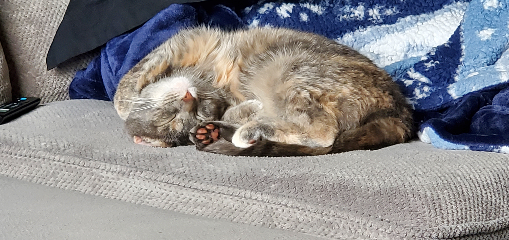

<!-- > Add Markdown syntax content to file `_tabs/about.md`{: .filepath } and it will show up on this page.
{: .prompt-tip } -->

### Hello and welcome to my website!

So... you have found your way here.  
A little about me... My name is Alexander, but I go by Alex or Kali (military and friend nickname). 

### Little overview
I love all things technical and mechanical. I started at a young age taking computers apart. This turned into me experimenting with other things such as small engines on motorcycles, then moving up to V10s and some V12s.  

### Music
Music is something that runs deep within my personality. I mainly listen to a bunch of EDM (Above & Beyond, Edward Maya, Eric Prydz, and Jacob Plant, to name a few...). I do dabble in other genres as I am usually open to listening to them. Country is my least favorite genre unless it is old school.

### Charlie
I have a little cat named Charlie and she is 3 years old (turning 4 in August). She is absolutely adorbale in every way and is a very big part of my life. With her, I feel unstoppable. She helps me with my tech issues and debugging my server rack. 

### Education
I graduated from the University of Nebraska - Omaha with a bachelors in Cyber Security and a minor in Computer Science and French. I currently know 5 languages (French, Russian, German, Romanian, and English), but not fluent within speaking 4 of them. I can decently read and write them.

### Hobbies
Last thing, I have way too <u>many</u> hobbies. I love being active and keeping myself busy. Sitting still isn't a thing for me. I strive for success and from those that know me, will say I am too passionate for success.  

Stick around to learn more about what I want to do! 😄